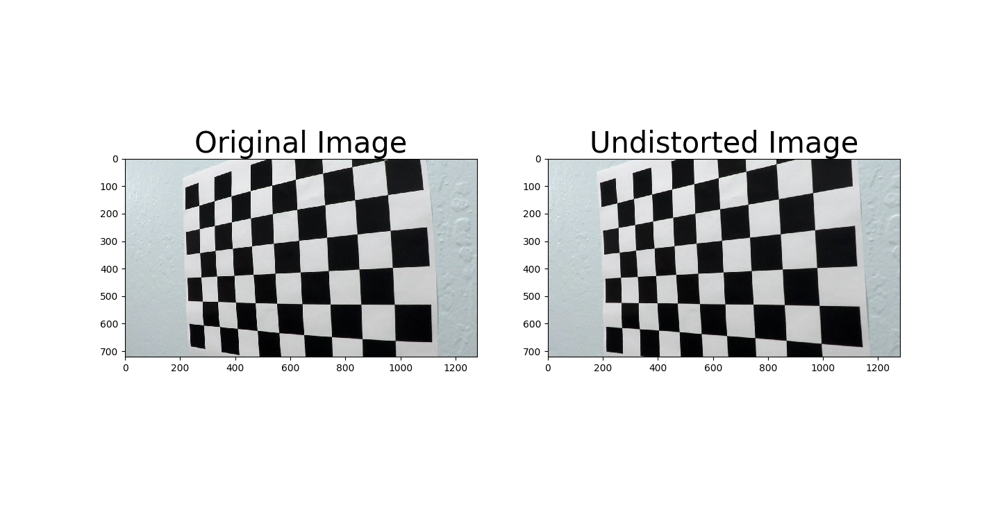
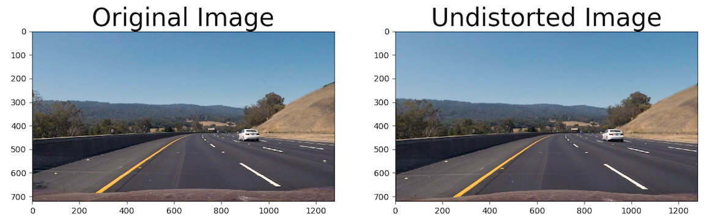
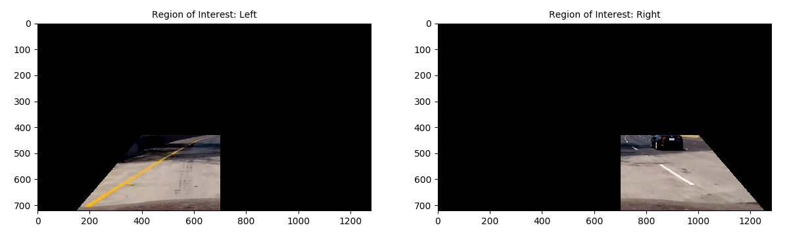
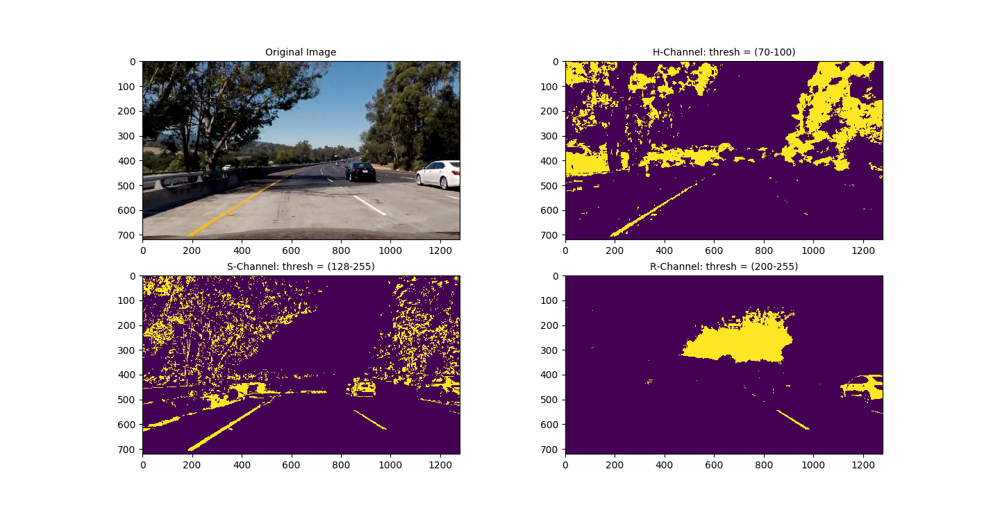
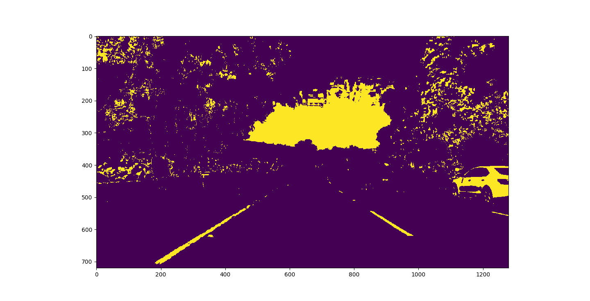

## Advanced Lane Finding Project

The goal of this project is to identify and mark the driving lanes in the provided input images/videos.  

The steps of this project are the following:

* Setups

&nbsp;&nbsp;&nbsp;&nbsp;&nbsp;&nbsp; S1.  Compute the camera calibration matrix and distortion coefficients given a set of chessboard images  
&nbsp;&nbsp;&nbsp;&nbsp;&nbsp;&nbsp; S2.  Setup helper functions for color transform / thresholding  
&nbsp;&nbsp;&nbsp;&nbsp;&nbsp;&nbsp; S3.  Obtain warp matrix for perspective transform  
&nbsp;&nbsp;&nbsp;&nbsp;&nbsp;&nbsp; S4.  Setup helper functions for lane recognition  
&nbsp;&nbsp;&nbsp;&nbsp;&nbsp;&nbsp; S5.  Setup helper functions for curvature calculation  

* Applications  

&nbsp;&nbsp;&nbsp;&nbsp;&nbsp;&nbsp; A1. Apply a distortion correction to raw images  
&nbsp;&nbsp;&nbsp;&nbsp;&nbsp;&nbsp; A2. Use color transforms, gradients, etc., to create a thresholded binary image  
&nbsp;&nbsp;&nbsp;&nbsp;&nbsp;&nbsp; A3. Apply a perspective transform to rectify binary image ("birds-eye view")  
&nbsp;&nbsp;&nbsp;&nbsp;&nbsp;&nbsp; A4. Detect lane pixels and fit to find the lane boundary  
&nbsp;&nbsp;&nbsp;&nbsp;&nbsp;&nbsp; A5. Determine the curvature of the lane and vehicle position with respect to center  
&nbsp;&nbsp;&nbsp;&nbsp;&nbsp;&nbsp; A6. Warp the detected lane boundaries back onto the original image  
&nbsp;&nbsp;&nbsp;&nbsp;&nbsp;&nbsp; A7. Output visual display of the lane, estimation of lane curvature and vehicle position

[//]: # (Image References)

[image1]: ./examples/undistort_output.png "Undistorted"
[image2]: ./test_images/test1.jpg "Road Transformed"
[image3]: ./examples/binary_combo_example.jpg "Binary Example"
[image4]: ./examples/warped_straight_lines.jpg "Warp Example"
[image5]: ./examples/color_fit_lines.jpg "Fit Visual"
[image6]: ./examples/example_output.jpg "Output"
[video1]: ./project_video.mp4 "Video"

## [Rubric Points](https://review.udacity.com/#!/rubrics/571/view)

### Here I will consider the rubric points individually and describe how I addressed each point in my implementation.  

---

### S1. Camera Calibration

The code for this step is contained in [IPython notebook](advLaneFind.ipynb), section "S1. Get camera calibration matrix".

I start by preparing "object points", which will be the (x, y, z) coordinates of the chessboard corners in the world. Here I am assuming the chessboard is fixed on the (x, y) plane at z=0, such that the object points are the same for each calibration image.  Thus, `objp` is just a replicated array of coordinates, and `objpoints` will be appended with a copy of it every time I successfully detect all chessboard corners in a test image.  `imgpoints` will be appended with the (x, y) pixel position of each of the corners in the image plane with each successful chessboard detection.  

I then used the output `objpoints` and `imgpoints` to compute the camera calibration and distortion coefficients using the `cv2.calibrateCamera()` function.  I applied this distortion correction to the test image using the `cv2.undistort()` function and obtained this result: 

When this is applied to the actual road image, it looks like below. Differences can be observed on the bottom left and right corners.

### S2. Color Transform

I first put 'region of interest' mask for each left lane and right lane, since it is inevitable that these color thresholding takes up many sorrounding noises if they have similar color as lanes.  
I used H- and S- channels of HLS transform, and R- channel of RGB transform, as I found these three to be most important from experiments. In particular, H- channel is good at taking up yellowu-like color, S- is for bright color in general (i.e. both yellow and white), and R- takes up white color very well. Since H- and S- takes up lots of sorrunding noise as well, I made a mask `(H-Channel & S-Channel | R-Channel)`. In the code, helper functions for all types of color transforms are available. Shown below is an example how the image is transformed after each masking, as well as all 3 combined.

#### S3. Perspective Transform

The code for my perspective transform is in "S3. Perspective Transform" of IPython Notebook. It uses openCV function, `cv2.getPerspectiveTransform`, which takes source and destination points and returns warp matrix, `M`.  I chose the hardcode the source and destination points by observation.

This resulted in the following source and destination points:

warpSrc = np.float32([[430.5, 566], [867.7, 566],[1052, 682],[269, 682]])
warpDst = np.float32([[269, 566], [1052, 566], [1052, 682], [269, 682]])

| Source        | Destination   | 
|:-------------:|:-------------:| 
| 430.5, 566      | 269, 566        | 
| 867.7, 566      | 1052, 566      |
| 1052, 682     | 1052, 682      |
| 269, 682      | 269, 682        |

I verified that my perspective transform was working as expected by drawing the `src` and `dst` points onto a test image and its warped counterpart to verify that the lines appear parallel in the warped image.

![alt text][image4]

#### 4. Describe how (and identify where in your code) you identified lane-line pixels and fit their positions with a polynomial?

Then I did some other stuff and fit my lane lines with a 2nd order polynomial kinda like this:

![alt text][image5]

#### 5. Describe how (and identify where in your code) you calculated the radius of curvature of the lane and the position of the vehicle with respect to center.

I did this in lines # through # in my code in `my_other_file.py`

#### 6. Provide an example image of your result plotted back down onto the road such that the lane area is identified clearly.

I implemented this step in lines # through # in my code in `yet_another_file.py` in the function `map_lane()`.  Here is an example of my result on a test image:

![alt text][image6]

---

### Pipeline (video)

#### 1. Provide a link to your final video output.  Your pipeline should perform reasonably well on the entire project video (wobbly lines are ok but no catastrophic failures that would cause the car to drive off the road!).

Here's a [link to my video result](./project_video.mp4)

---

### Discussion/Future work

There are 3 videos with different difficulties, provided by Udacity. For the easiest version ([easiest original](project_video.mp4)), the advanced techniques mentioned above (left-right split, segment check, confidence check, and polynomial check) were not really necessary: even without them, the output of the video looked very good ([easiest output](output_project_video.mp4)). These were implemented, however, to tackle more difficult videos, medium ([medium original](challenge_video.mp4)) and hardest ([hardest original](harder_challenge_video.mp4)).  

For the medium level, the algorithm looks to be working fine for the most of the time, although it still requires some further refinement. The result is shown here ([medium output](outputs/challenge_video.mp4)). The key factor for this particular video was the segment check and filtering: the original naive algorithm tend to pick the noises as the lines, which are totally misaligned with the vehicle, and segment check enforces the lines to start from two edges of the hood. Filterling smoothes out the measurement, as well as eliminates noise in measurements if it is only for 1-2 frames.  

For the hardest level, my algorithm is insufficient, since it relies on the assumption that good meeasurement shall be the majority, as well as left and right lanes shall be found and be parallel to each other. As shown in the result ([hardest output](outputs/harder_challenge_fideo.mp4)), it has no idea when one of the two lane lines is missing for significant amount of time.  

The possible solution for this is to use only one of the two lanes as reference if the measurement confidence is high, just as what Tesla Autopilot does. However, this requires even more sophisticated algorithm, since incorrect measurement on one lane can result in fatal consequence. One way to handle this is letting the system to say "no lane found", just as, again, Tesla vehicles, but I need to make further research for this. The other potential solution is to use sensors like radar or ultrasonic sensor to identify the boundary, but this is out of the scope of this project.
