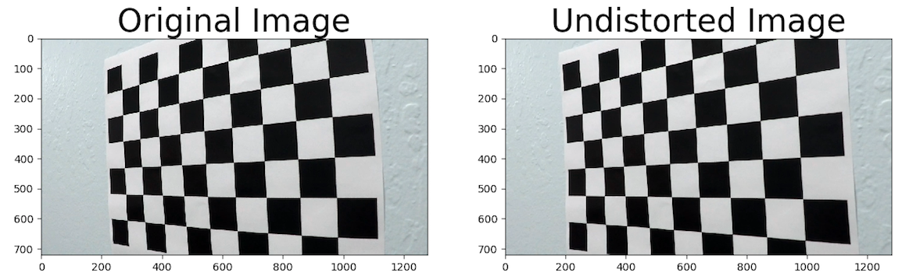
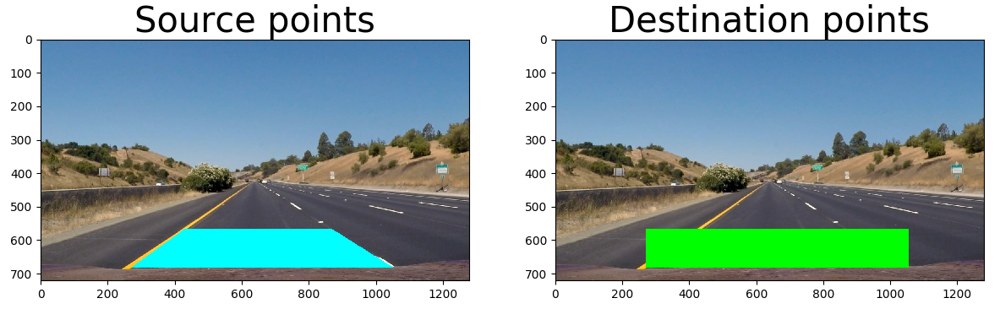
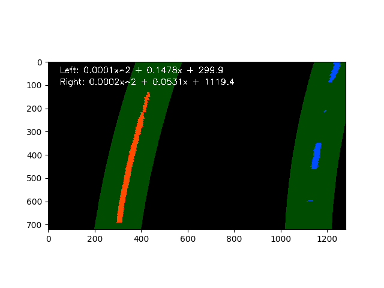
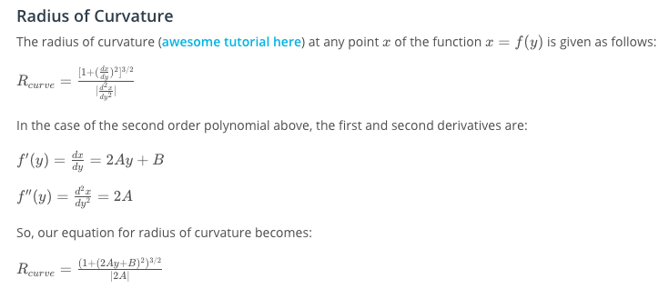
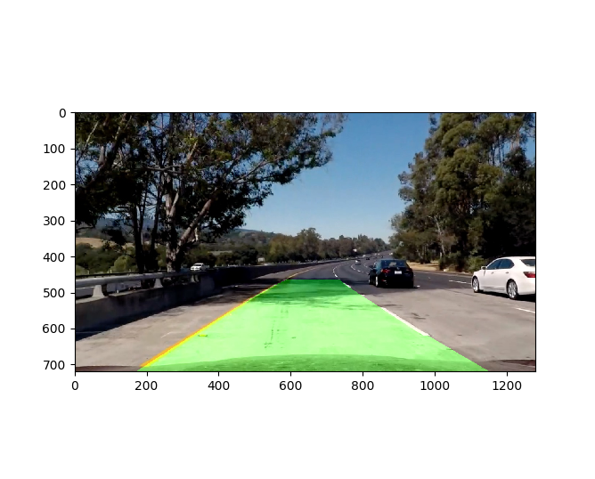

## Output video: https://www.youtube.com/watch?v=Rjo2QN6ICC0

## Advanced Lane Finding Project

The goal of this project is to identify and mark the driving lanes in the provided input images/videos.  

The steps of this project are the following:

* Setups

&nbsp;&nbsp;&nbsp;&nbsp;&nbsp;&nbsp; S1.  Compute the camera calibration matrix and distortion coefficients given a set of chessboard images  
&nbsp;&nbsp;&nbsp;&nbsp;&nbsp;&nbsp; S2.  Setup helper functions for color transform / thresholding  
&nbsp;&nbsp;&nbsp;&nbsp;&nbsp;&nbsp; S3.  Obtain warp matrix for perspective transform  
&nbsp;&nbsp;&nbsp;&nbsp;&nbsp;&nbsp; S4.  Setup helper functions for lane recognition  
&nbsp;&nbsp;&nbsp;&nbsp;&nbsp;&nbsp; S5.  Setup helper functions for curvature calculation  

* Applications  

&nbsp;&nbsp;&nbsp;&nbsp;&nbsp;&nbsp; A1. Apply a distortion correction to raw images  
&nbsp;&nbsp;&nbsp;&nbsp;&nbsp;&nbsp; A2. Use color transforms, gradients, etc., to create a thresholded binary image  
&nbsp;&nbsp;&nbsp;&nbsp;&nbsp;&nbsp; A3. Apply a perspective transform to rectify binary image ("birds-eye view")  
&nbsp;&nbsp;&nbsp;&nbsp;&nbsp;&nbsp; A4. Detect lane pixels and fit to find the lane boundary  
&nbsp;&nbsp;&nbsp;&nbsp;&nbsp;&nbsp; A5. Determine the curvature of the lane and vehicle position with respect to center  
&nbsp;&nbsp;&nbsp;&nbsp;&nbsp;&nbsp; A6. Warp the detected lane boundaries back onto the original image  
&nbsp;&nbsp;&nbsp;&nbsp;&nbsp;&nbsp; A7. Output visual display of the lane, estimation of lane curvature and vehicle position

[//]: # (Image References)

[image1]: ./examples/undistort_output.png "Undistorted"
[image2]: ./test_images/test1.jpg "Road Transformed"
[image3]: ./examples/binary_combo_example.jpg "Binary Example"
[image4]: ./examples/warped_straight_lines.jpg "Warp Example"
[image5]: ./examples/color_fit_lines.jpg "Fit Visual"
[image6]: ./examples/example_output.jpg "Output"
[video1]: ./project_video.mp4 "Video"

### [Rubric Points](https://review.udacity.com/#!/rubrics/571/view)

#### Here I will consider the rubric points individually and describe how I addressed each point in my implementation.  

---

#### S1/A1. Camera Calibration

The code for this step is contained in [IPython notebook](advLaneFind.ipynb), section "S1. Get camera calibration matrix".

I start by preparing "object points", which will be the (x, y, z) coordinates of the chessboard corners in the world. Here I am assuming the chessboard is fixed on the (x, y) plane at z=0, such that the object points are the same for each calibration image.  Thus, `objp` is just a replicated array of coordinates, and `objpoints` will be appended with a copy of it every time I successfully detect all chessboard corners in a test image.  `imgpoints` will be appended with the (x, y) pixel position of each of the corners in the image plane with each successful chessboard detection.  

I then used the output `objpoints` and `imgpoints` to compute the camera calibration and distortion coefficients using the `cv2.calibrateCamera()` function.  I applied this distortion correction to the test image using the `cv2.undistort()` function and obtained this result: 

When this is applied to the actual road image, it looks like below. Differences can be observed on the bottom left and right corners.

#### S2/A2. Color Transform

I first put 'region of interest' mask for each left lane and right lane, since it is inevitable that these color thresholding takes up many sorrounding noises if they have similar color as lanes.  
I used H- and S- channels of HLS transform, and R- channel of RGB transform, as I found these three to be most important from experiments. In particular, H- channel is good at taking up yellowu-like color, S- is for bright color in general (i.e. both yellow and white), and R- takes up white color very well. Since H- and S- takes up lots of sorrunding noise as well, I made a mask `(H-Channel & S-Channel | R-Channel)`. In the code, helper functions for all types of color transforms are available. Shown below are an example how the image is transformed after each masking, as well as all 3 combined.

#### S3/A3. Perspective Transform

The code for my perspective transform is in "S3. Perspective Transform" of IPython Notebook. It uses openCV function, `cv2.getPerspectiveTransform`, which takes source and destination points and returns warp matrix, `M`.  I chose the hardcode the source and destination points by observation.

This resulted in the following source and destination points:

warpSrc = np.float32([[430.5, 566], [867.7, 566],[1052, 682],[269, 682]])
warpDst = np.float32([[269, 566], [1052, 566], [1052, 682], [269, 682]])

| Source        | Destination   | 
|:-------------:|:-------------:| 
| 430.5, 566      | 269, 566        | 
| 867.7, 566      | 1052, 566      |
| 1052, 682     | 1052, 682      |
| 269, 682      | 269, 682        |

I verified that my perspective transform was working as expected by drawing the `src` and `dst` points onto a test image and its warped counterpart to verify that the lines appear parallel in the warped image.

#### S4/A4. Lane recognition

This is the key part of my algorithm. For polynomial fitting, two different algorithms are applied, based on whether lane was found in previous iteration or not. When previous lane presents, the algorithm only searches new line around the previous line. When no line was found in the previous iteration, however, search with sliding windows is performed. It takes histogram of the image, where lane lines show higher histogram value if color transform was performed properly. Shown below is an example of the output.

Since real road images contain many noises, including different color on pavement or going through shaded area, I implemented following 3 filters to assure the lane lines to exist in resonable position. These filters can be triggered by setting flags, `confidenceCheck`, `polynomialCheck`, and `segmentCheck`.

`confidenceCheck` sees how confident the algorithm predicted new lines, which is defined as the number of points taken for the polynomial fitting. If this number is low, it means the new polynomial fitting is uncertain. When low confidence is returned more than certain times, the following happens:
* If one of the left or right lines has high confidence, shift it to the side with low confidence
* If both lines have low confidence, keep the measurement from previous iteration

`polynomialCheck` checks if the polynomial coefficient, `a` in `ax^2 + bx + c`, is similar between left and right lanes. This is due to the fact that road lanes are almost parallel to each other, as well as the change in road curvature is continuous (no huge gap in 1 video frame). If the difference of `a` value between left and right is large, following calculation happens:
* Compare the `a` value of each lane with the previous iteration, and the one with bigger difference would be replaced with the one with smaller difference

`segmentCheck` assures the lanes are starting from two edges of the hood, which should be always the case unless lane-change is happening. `c` value in the polynomial equation is used as the measurement, and in order to align the `c` value with the bottom of the image, the image is flipped before fed into the algorithm. If the segment is found to be in unreasonable range, the following is executed:
* If one of the left or right segments is out of range, take the `a` and `b` value from the other lane and use the segment from the previous iteration
* If both of left and right segments are out of range, keep the measurement from previous iteration

#### S5/A5. Radius of curvature and vehicle position in the lane

The code is in `def curvatureCalc()`. The calculation is based on the formula, provided by Udacity, shown in the image below.

#### A6+A7. Warp back and plot onto original image

I used the inverse warp matrix that is calculated in S3/A3 to convert warped lane area to lane area in normal perspective. Code is in `def warpBackLines()` and `advLaneFind()`. Shown below is an example of my result on a test image:

---

### Video Output
Here's a [link to my video result](outputs/prcsd_project_video.mp4)

---

### Discussion/Future work

There are 3 videos with different difficulties, provided by Udacity. For the easiest version ([easiest original](project_video.mp4)), the advanced techniques mentioned above (left-right split, segment check, confidence check, and polynomial check) were not really necessary: even without them, the output of the video looked very good ([easiest output](output_project_video.mp4)). These were implemented, however, to tackle more difficult videos, medium ([medium original](challenge_video.mp4)) and hardest ([hardest original](harder_challenge_video.mp4)).  

For the medium level, the algorithm looks to be working fine for the most of the time, although it still requires some further refinement. The result is shown here ([medium output](outputs/challenge_video.mp4)). The key factor for this particular video was the segment check and filtering: the original naive algorithm tend to pick the noises as the lines, which are totally misaligned with the vehicle, and segment check enforces the lines to start from two edges of the hood. Filterling smoothes out the measurement, as well as eliminates noise in measurements if it is only for 1-2 frames.  

For the hardest level, my algorithm is insufficient, since it relies on the assumption that good meeasurement shall be the majority, as well as left and right lanes shall be found and be parallel to each other. As shown in the result ([hardest output](outputs/harder_challenge_fideo.mp4)), it has no idea when one of the two lane lines is missing for significant amount of time.  

The possible solution for this is to use only one of the two lanes as reference if the measurement confidence is high, just as what Tesla Autopilot does. However, this requires even more sophisticated algorithm, since incorrect measurement on one lane can result in fatal consequence. One way to handle this is letting the system to say "no lane found", just as, again, Tesla vehicles, but I need to make further research for this. The other potential solution is to use sensors like radar or ultrasonic sensor to identify the boundary, but this is out of the scope of this project.
